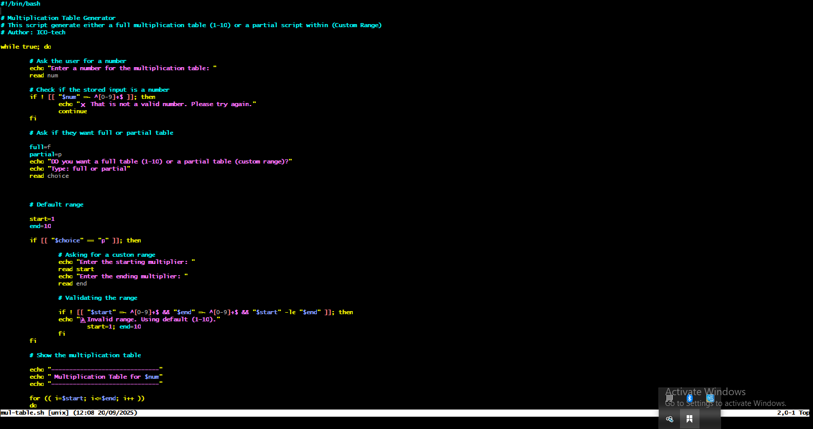
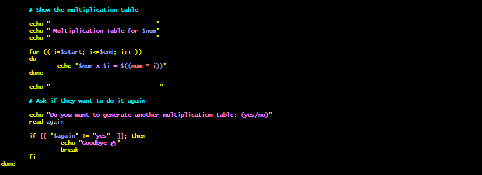
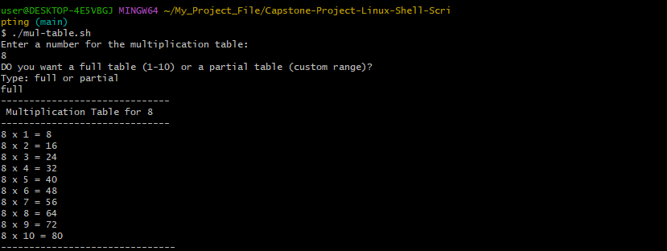
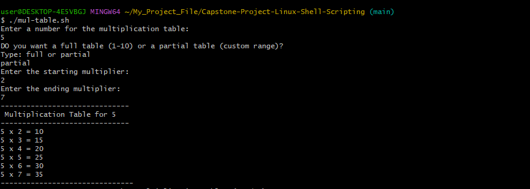
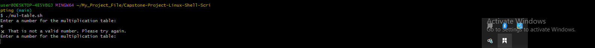
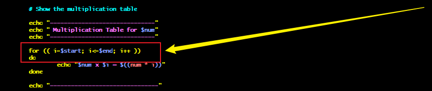
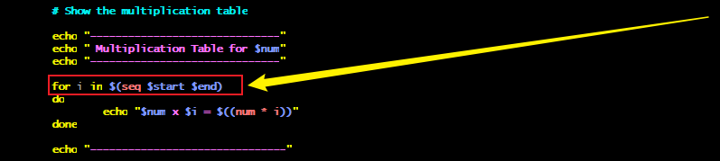

# Capstone-Project-Linux-Shell-Scripting
```
This project explores Bash scripting through loops, user input, and conditional logic. It highlights how loops automate repetitive tasks, user input makes scripts interactive, and conditions control execution flow. Together, these elements create dynamic and efficient scripts, forming a foundation for advanced automation.
```
## Objective
```
Create a Bash script that generates a multiplication table for a number entered by the user.
```
## Description
```
The script will ask the user to enter a number, then choose between showing the full table (1–10) or a custom range. It will then display the multiplication table based on the user’s choice.
```
# Work Flow

### Prompt user for a number: 
- Ask the user: “Enter a number for the multiplication table:”
- Store it in a variable, e.g., num.
- Check if the stored input is a number

### Ask for table type (full or partial)
- Ask: “Do you want a full table (1–10) or a partial table (custom range)? (Enter full/partial): ”
- Store the answer in a variable called:wq
-  choice.

### If full table:
- Loop from 1 to 10 using a for loop.
- Print results in a nice format.

### If partial table:
- Ask for a start number.
- Ask for an end number.
- Validate inputs:
- Both must be integers.
- Start ≤ End.
- Both should be within a reasonable range (e.g., positive numbers).
- If invalid → show a message and default to full table.

### Generate the table
- Use a loop (for i in $(seq $start $end)) to print multiplication results.

## Sreenshot for the script
```
 In this section, I have developed a complete Bash script that generates a multiplication table. The script is written in a structured way, and I have included comments throughout the code to explain the purpose of each block and the logic behind it. These comments provide clarity on how the script works, making it easier to understand and follow. Also, I initially used the C-style of loop and later useed the list-style loop. Below is the full version of the script presented as a screenshot.
```



## Full Multiplication Table Using C-style loop
```
After completing the script and saving it as mul-table.sh, I proceeded to execute it in the terminal. For testing, I entered the number 8 as input and selected the option to generate the full multiplication table. The script successfully displayed the complete table for the number 8, confirming that the logic and implementation worked as expected. A screenshot of the executed code and its output is provided below for reference.
```


## Partial Multiplication Table Using C-style loop
```
In this step, I executed the script and tested it by generating a multiplication table for the number 5. Instead of running the full table, I selected the option to create a partial table within a custom range, specifically from 2 to 7. The script correctly produced the output for this defined range, demonstrating that the conditional logic for handling custom inputs works as intended. A screenshot of the execution and result is provided below for better illustration.
```


## Error Handling
```
At this stage, I deliberately entered an invalid input to test the script’s error-handling capability. The script successfully detected the invalid entry and displayed the appropriate error message, confirming that the validation logic works effectively. This demonstrates that the script is robust enough to manage unexpected or incorrect user inputs. 
```


## Exit
```
To conclude the process, I reached the final part of the script where it prompted me to decide whether I wanted to generate another multiplication table. When asked, I chose the option “no”, which triggered the exit condition and gracefully ended the script. This confirmed that the loop and exit logic function correctly, allowing the program to terminate smoothly based on the user’s choice.
```


## C-style-loop
```
 In this part of the project, I implemented a C-style for loop in the script to generate the multiplication table. After writing the code, I executed the script, and it produced the expected output, identical to the List-style loop version. The results confirmed that the loop logic functions correctly. A screenshot of the executed script is provided below for reference.
```
 

## List-style loop
```
In this part of the project, I implemented a List-style for loop in the script to generate the multiplication table. After writing the code, I executed the script, and it produced the expected output, identical to the C-style loop version. The results confirmed that the loop logic functions correctly. A screenshot of the executed script is provided below for reference.
```

